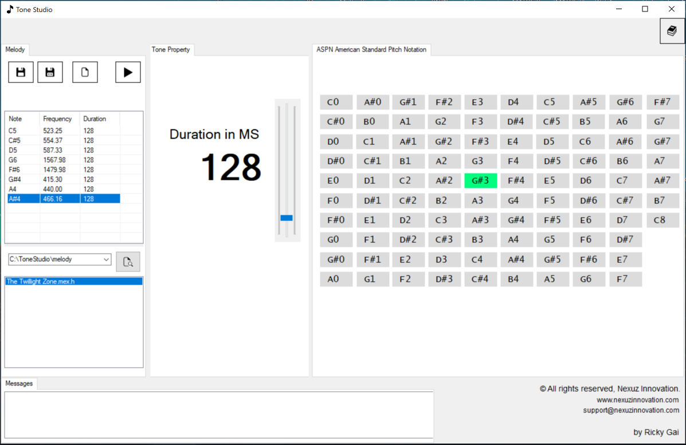

# Tone Studio
**A mono tone audio editing software for Microsoft Windows.**
  

# What is Tone Studio software ?
- To compose own mono tone melody.

- 97 notes of ASPN American Standard Pitch Notation.

- Edit, save, playback and output composed tone melody to C/C++ header file format.

- Arduino C/C++ sketch compatible, check out the demo [HERE](https://drive.google.com/file/d/1MXhUsjOQoxmVl7hEdogBaWM4x9ibQpun/view?usp=sharing).

- Publish your composed tone melody in other projects at royalty free.
  

Tone Studio coming to Windows Store soon ...stay tuned.
  
